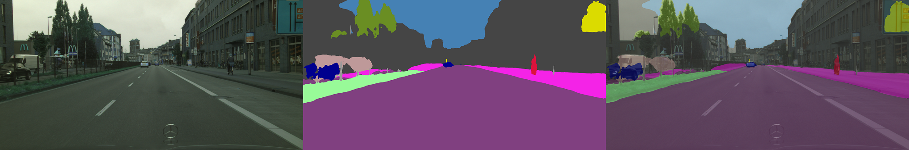
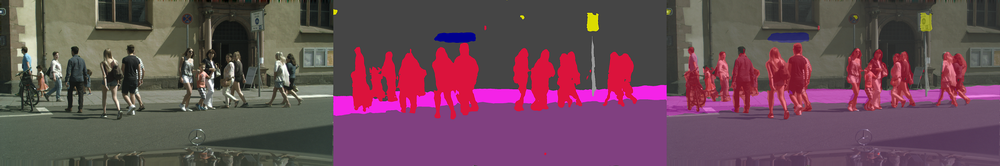
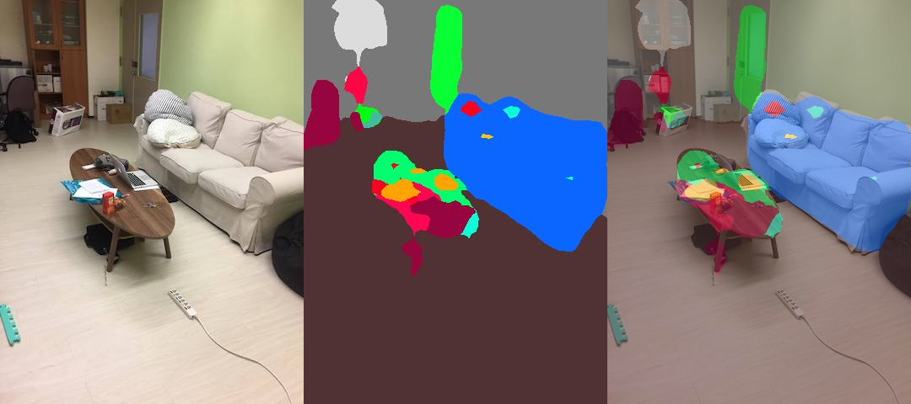

# ICNet_tensorflow
  This repo provides a TensorFlow-based implementation of paper "[ICNet for Real-Time Semantic Segmentation on High-Resolution Images](https://arxiv.org/abs/1704.08545)," by Hengshuang Zhao, and et. al. (ECCV'18).
  
  The model generates segmentation mask for every pixel in the image. It's based on the ResNet50 with totally three branches as auxiliary paths, see architecture below for illustration.
  
 
  
  We provide both training and inference code in this repo. The pre-trained models we provided are converted from caffe weights in [Official Implementation](https://github.com/hszhao/ICNet). 

## News (2018.10.22 updated):
  Now you can try ICNet on your own image online using [ModelDepot live demo](https://modeldepot.io/hellochick/icnet)!
  
## Table Of Contents
- [Environment Setup](#environment)
- [Download Weights](#download-weights)
- [Download Dataset](#download-dataset)
  + [ade20k](#download-ade20k)
  + [cityscapes](#download-cityscapes)
- [Get Started!](#get-started)
  + [Inference on your own image](#inference)
  + [Evaluate on cityscapes/ade20k dataset](#evaluation)
  + [Training on your own dataset](#training)
  
## Environment Setup <a name="environment"></a>
```
pip install tensorflow-gpu opencv-python jupyter matplotlib tqdm
```

## Download Weights <a name="download-weights"></a>
We provide pre-trained weights for [cityscapes](https://www.cityscapes-dataset.com/) and [ADE20k](http://sceneparsing.csail.mit.edu/) dataset. You can download the weights easily use following command,

```
python script/download_weights.py --dataset cityscapes (or ade20k)
```

## Download Dataset (Optional) <a name="download-dataset"></a>
If you want to evaluate the provided weights or keep fine-tuning on cityscapes and ade20k dataset, you need to download them using different methods.

### ADE20k dataset <a name="download-ade20k"></a>
Simply run following command:

```
bash script/download_ADE20k.sh
```

### Cityscapes dataset <a name="download-cityscapes"></a>
You need to download Cityscape dataset from [Official website](https://www.cityscapes-dataset.com/) first (you'll need to request access which may take couple of days).

Then convert downloaded dataset ground truth to training format by following [instructions to install cityscapesScripts](https://github.com/mcordts/cityscapesScripts) then running these commands:
```bash
export CITYSCAPES_DATASET=<cityscapes dataset path>
csCreateTrainIdLabelImgs
```

## Get started! <a name="get-started"></a>
This repo provide three phases with full documented, which means you can try train/evaluate/inference on your own.

### Inference on your own image<a name="inference"></a>
[demo.ipynb](./demo.ipynb) show the easiest example to run semantic segmnetation on your own image. 




In the end of [demo.ipynb](./demo.ipynb), you can test the speed of ICNet.

Here are some results run on Titan Xp with high resolution images (1024x2048):  
**~0.037(s) per images, which means we can get ~27 fps** (nearly same as described in paper).

### Evaluate on cityscapes/ade20k dataset <a name="evaluation"></a>
To get the results, you need to follow the steps metioned above to download dataset first.  
Then you need to change the `data_dir` path in [config.py](./utils/config.py#L6).

```python
CITYSCAPES_DATA_DIR = '/data/cityscapes_dataset/cityscape/'
ADE20K_DATA_DIR = './data/ADEChallengeData2016/'
```

#### Cityscapes
Perform in single-scaled model on the cityscapes validation dataset. (We have sucessfully re-produced the performance same to caffe framework).

| Model | Accuracy | Model | Accuracy |
|:-----------:|:----------:|:---------:|:---------:|
| train_30k   | **67.26%/67.7%** | train_30k_bn |**67.31%/67.7%** |
| trainval_90k| **80.90%**    | trainval_90k_bn |**0.8081%** |

Run following command to get evaluation results,
```
python evaluate.py --dataset=cityscapes --filter-scale=1 --model=trainval
```

List of Args:
```
--model=train       - To select train_30k model
--model=trainval    - To select trainval_90k model
--model=train_bn    - To select train_30k_bn model
--model=trainval_bn - To select trainval_90k_bn model
```

### ADE20k
Reach **32.25%mIoU** on ADE20k validation set.

```
python evaluate.py --dataset=ade20k --filter-scale=2 --model=others
```
> Note: to use model provided by us, set `filter-scale` to 2.

## Training on your own dataset <a name="training"></a>
This implementation is different from the details descibed in ICNet paper, since I did not re-produce model compression part. Instead, we **train on the half kernels directly**.  

In orignal paper, the authod trained the model in full kernels and then performed model-pruning techique to kill half kernels. Here **we use --filter-scale to denote whether pruning or not**. 

For example, `--filter-scale=1` <-> `[h, w, 32]` and `--filter-scale=2` <-> `[h, w, 128]`. 

### Step by Step
**1. Change the configurations** in [utils/config.py](./utils/config.py).

```python
cityscapes_param = {'name': 'cityscapes',
                    'num_classes': 19,
                    'ignore_label': 255,
                    'eval_size': [1025, 2049],
                    'eval_steps': 500,
                    'eval_list': CITYSCAPES_eval_list,
                    'train_list': CITYSCAPES_train_list,
                    'data_dir': CITYSCAPES_DATA_DIR}
```

**2. Set Hyperparameters** in `train.py`, 

```python
class TrainConfig(Config):
    def __init__(self, dataset, is_training,  filter_scale=1, random_scale=None, random_mirror=None):
        Config.__init__(self, dataset, is_training, filter_scale, random_scale, random_mirror)

    # Set pre-trained weights here (You can download weight using `python script/download_weights.py`) 
    # Note that you need to use "bnnomerge" version.
    model_weight = './model/cityscapes/icnet_cityscapes_train_30k_bnnomerge.npy'
    
    # Set hyperparameters here, you can get much more setting in Config Class, see 'utils/config.py' for details.
    LAMBDA1 = 0.16
    LAMBDA2 = 0.4
    LAMBDA3 = 1.0
    BATCH_SIZE = 4
    LEARNING_RATE = 5e-4
```

**3.** Run following command and **decide whether to update mean/var or train beta/gamma variable**.
```
python train.py --update-mean-var --train-beta-gamma \
      --random-scale --random-mirror --dataset cityscapes --filter-scale 1
```

**Note: Be careful to use `--update-mean-var`!** Use this flag means you will update the moving mean and moving variance in batch normalization layer. This **need large batch size**, otherwise it will lead bad results. 

### Result (inference with my own data)


## Citation
    @article{zhao2017icnet,
      author = {Hengshuang Zhao and
                Xiaojuan Qi and
                Xiaoyong Shen and
                Jianping Shi and
                Jiaya Jia},
      title = {ICNet for Real-Time Semantic Segmentation on High-Resolution Images},
      journal={arXiv preprint arXiv:1704.08545},
      year = {2017}
    }
    
    @inproceedings{zhou2017scene,
        title={Scene Parsing through ADE20K Dataset},
        author={Zhou, Bolei and Zhao, Hang and Puig, Xavier and Fidler, Sanja and Barriuso, Adela and Torralba, Antonio},
        booktitle={Proceedings of the IEEE Conference on Computer Vision and Pattern Recognition},
        year={2017}
    }
    
    @article{zhou2016semantic,
      title={Semantic understanding of scenes through the ade20k dataset},
      author={Zhou, Bolei and Zhao, Hang and Puig, Xavier and Fidler, Sanja and Barriuso, Adela and Torralba, Antonio},
      journal={arXiv preprint arXiv:1608.05442},
      year={2016}
    }
